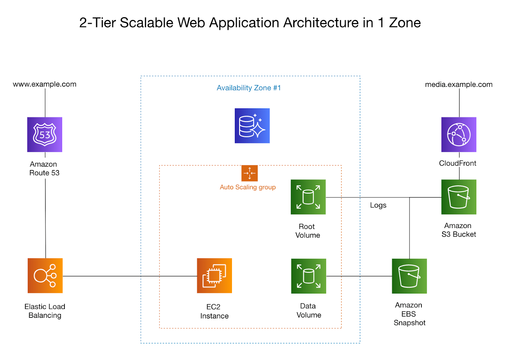

## Custom Shortcodes

Learn how to create and use custom shortcodes to extend Hugo's functionality.

## Content Organization

Tips for organizing your content with sections, taxonomies, and archetypes.

## Performance Optimization

Make your Hugo site faster with image compression, minification, and pipelining.

